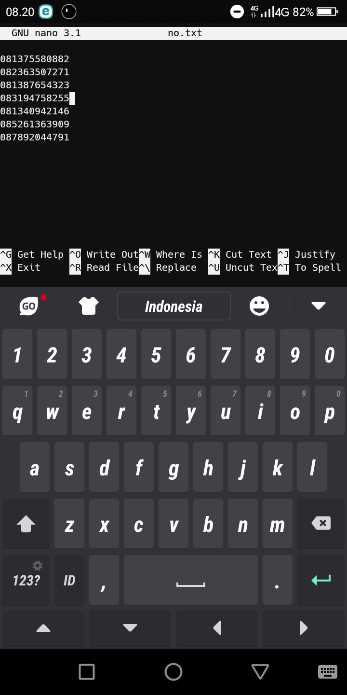
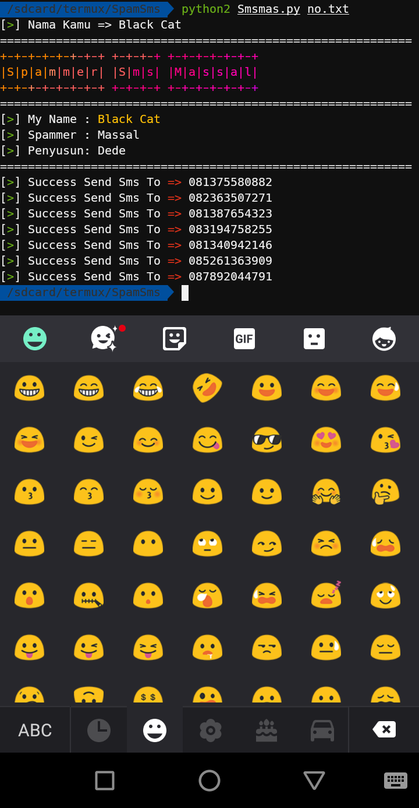

# Smsmas
```
Send Sms Massal To List no.txt
```

# Cara Install
```
apt update && apt upgrade
apt install git python2
apt install figlet nano ruby
gem install lolcat
pip2 install requests
git clone https://github.com/Senitopeng/Smsmas.git
cd Smsmas
python2 Smsmas.py no.txt
```

# Keterangan
Bikin Dulu List Nomernya, Contoh Masuk Menub Edit Ketik:
nano no.txt
Lalu isi Nomer2 target Ke dalam File no.txt dan save

# Tutorial Web
```
https;//www.senitopeng.xyz
```



